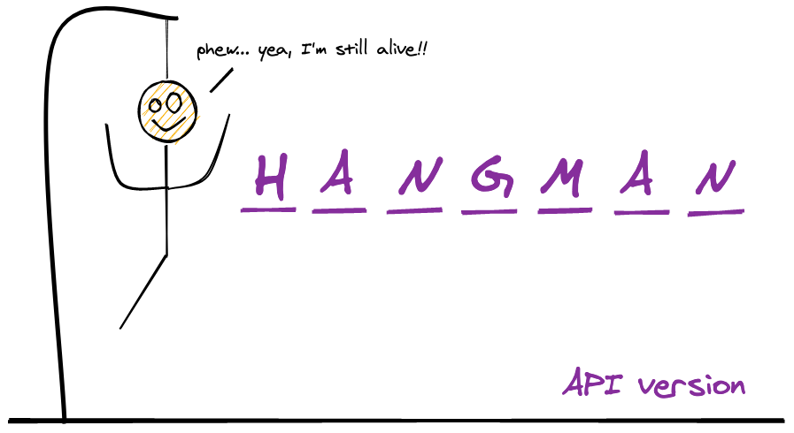
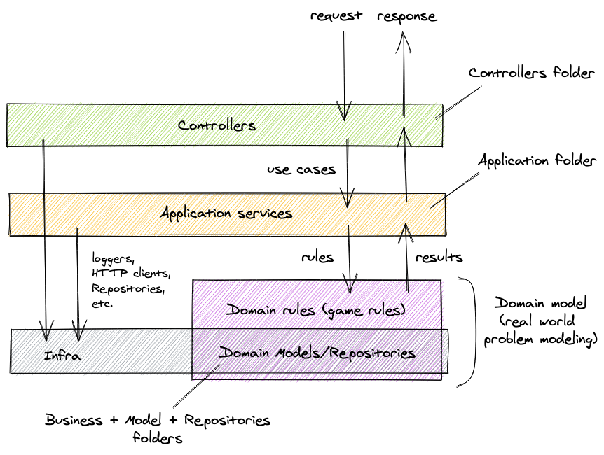
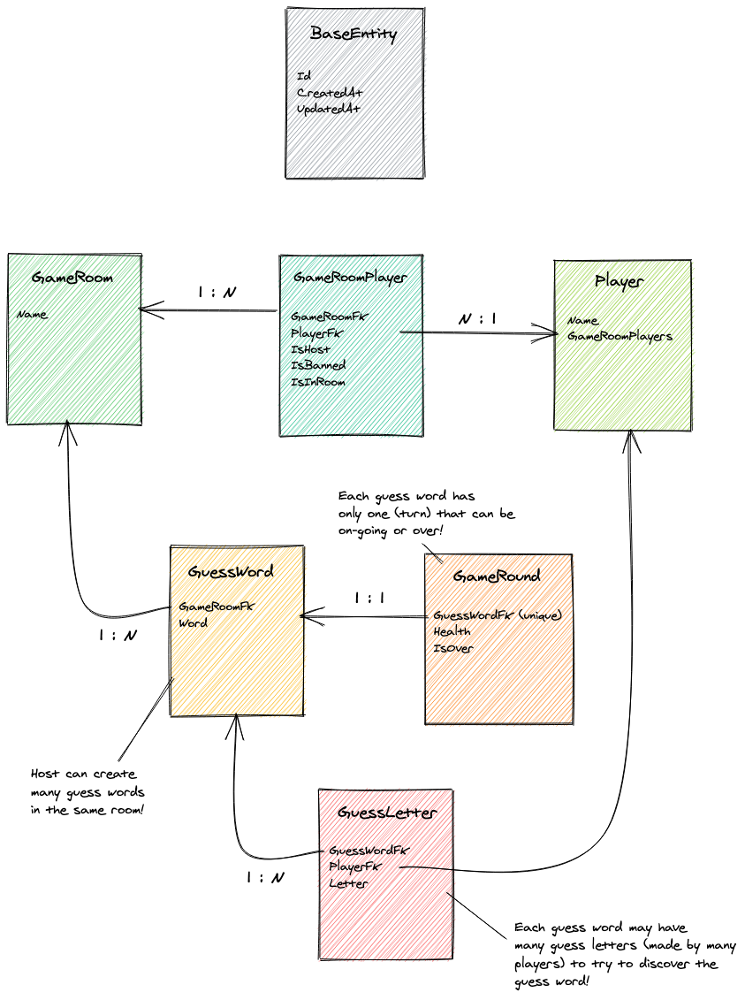

# Hangman

A Hangman (the old classic guess-the-word game) gaming API written in `C#` with `ASP.NET core` framework.



## API demo: winning (guessing) the word without being hanged


## API demo: losing a game (not guessing the word) by being hanged


# Hangman architecture



This application's architecture uses layered-design that can roughly be divided into:

- `Controller layer`
- `Application layer (use cases)`
- `Business layer`
- `Infra layer`

This model is much simpler than other famous modelings approaches, such as Domain Driven Design, but that's not a problem! It's actually just a different architectural approach that is definitely effective for domains that are not so complex but, at the same time, require more than bare CRUD logic.

This application comes with `Serilog` configure for sending logs to console's stdout and Elasticsearch (locally brought up via `docker-compose`).

# Hangman modeling (entities)



The presented entities were used to model the Hangman game problem.

## Running the project

As this project contains a `dockerized` application, it can be executed in development mode in two environments:

1. locally via the `dotnet` command line tool;
2. inside docker containers via `docker-compose`;

### 1. Locally via dotnet command line tool

Running locally has the huge advantage of being ultra easy to invoke the application and its tests with
debug. Due to the easy-to-debug feature , this it the recommended option.

Run the following commands on a terminal:

```bash
# the database and other services must be running and bound to the localhost's port
docker-compose up -d db

 # start project on localhost
dotnet run --project ./Hangman/Hangman.csproj
```

### 2. In a docker container via docker-compose

Running with `docker-compose` allows one to run without having `dotnet SDK` or anything else installed on his machine.

The project is started with the watch option which rebuilds/reloads the container upon code changes. However, bear in mind that, as of now, debugging is not yet supported.

Run the following commands on a terminal:

```bash
docker-compose up app  # brings up the app and its required services
```

## Running tests

Again, this can be done in two environments:

1. locally via the `dotnet` command line tool;
2. inside docker containers via `docker-compose`;

### 1. Locally via dotnet command line tool

Locally, they can be run with:

```
docker-compose up -d db
dotnet test
```

### 2. In a docker container via docker-compose

With a `docker-compose`:

```bash
docker-compose -f docker-compose-tests.yml up
```

## Project structure creation (so far)

```bash
# solution creation
dotnet new sln -n Hangman
dotnet sln list  # shows no projects in the solution

# projects creation
dotnet new webapi -n Hangman
dotnet new xunit -n Tests

 # projects wrapping inside the solution
dotnet sln add ./Hangman/Hangman.csproj  # adds project to the solution
dotnet sln add ./Tests/Tests.csproj  # adds project to the solution
```

## Adding migrations

```bash
dotnet ef migrations add MigrationName --project ./Hangman/Hangman.csproj --context HangmanDbContext -v
```

## Removing a migration (non-applied)

```bash
dotnet ef migrations remove  # removes last applied migration
```

## Applying migrations manually (done at runtime in this project)

```bash
dotnet ef database update --project  ./Hangman/Hangman.csproj
```

## Rolling back (reverting) to a specific migration (applied)

```bash
dotnet ef database update MigrationName --project  ./Hangman/Hangman.csproj
```
